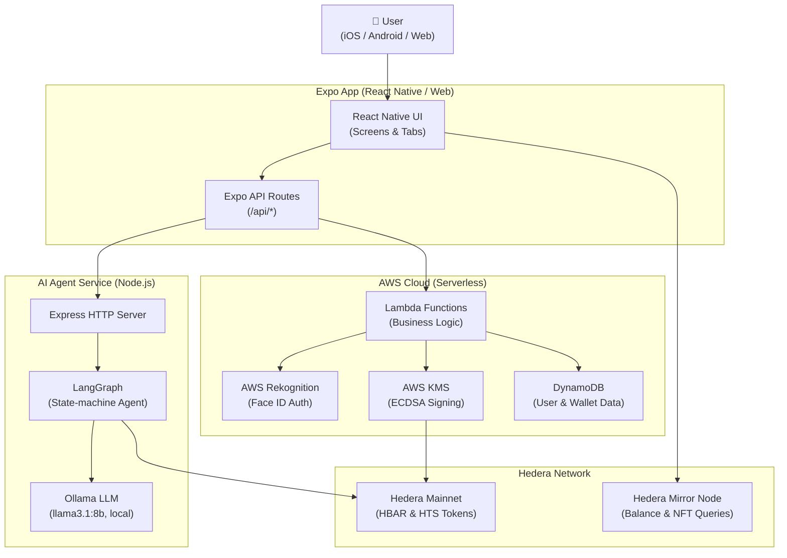
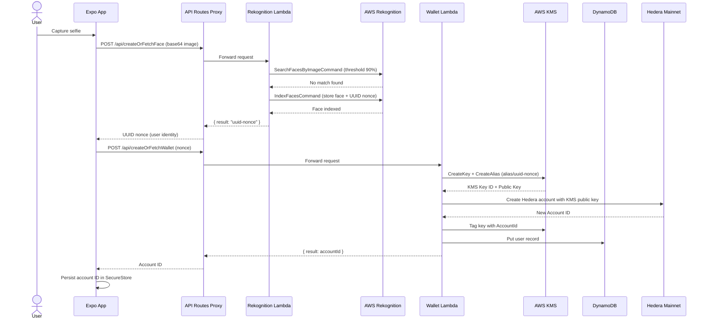
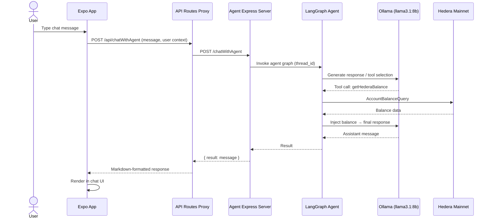

# System Architecture — EffiSend Hedera

---

## Overview

**EffiSend Hedera** is a cross-platform (iOS, Android, Web) mobile wallet application that enables fast, secure cryptocurrency payments on the Hedera Distributed Ledger network. The system is designed to eliminate the traditional seed-phrase barrier to self-custody by replacing private key management with **biometric facial recognition** backed by **AWS Key Management Service (KMS)**.

Users create and recover their wallets using Face ID (powered by AWS Rekognition). Every on-chain transaction is signed by AWS KMS ECDSA keys, so private keys are never exposed to the client. An integrated **AI financial agent** (LangChain + LangGraph + Ollama) provides real-time Hedera balance awareness and conversational payment assistance. The application is built on React Native / Expo and communicates with a serverless AWS backend via a thin Expo API Routes proxy layer.

---

## Key Requirements

### Functional Requirements
- Wallet creation and recovery via facial biometric — no seed phrases.
- Send and receive HBAR (native) and HTS (Hedera Token Service) tokens.
- QR-code generation and scanning for payment requests.
- NFT, POAP, and token pass gallery via Hedera Mirror Node.
- On-chain rewards earning and claiming.
- Conversational AI agent with live Hedera balance access.
- Transaction receipts with print support.
- Cross-platform: iOS, Android, Web browser.

### Non-Functional Requirements
- **Security:** Private keys must never leave AWS KMS; all signing is remote.
- **Privacy:** Biometric image data processed by AWS Rekognition; only a face vector/nonce is persisted — never raw images.
- **Performance:** Transactions must submit to Hedera Mainnet within normal ledger finality (~3–5 s).
- **Scalability:** Serverless AWS Lambda functions scale horizontally with demand.
- **Usability:** Web2-grade onboarding — no wallet jargon required.
- **Cross-Platform Parity:** Feature parity across iOS, Android, and Web via Expo/React Native Web.
- **Offline-First UX:** State cached locally with AsyncStorage / SecureStore; remote calls are non-blocking where possible.

---

## High-Level Architecture

The system is composed of four principal layers: the **Expo mobile/web client**, an **Expo API Routes proxy**, the **AWS serverless backend**, and the **Hedera network** (mainnet and mirror node). A standalone **AI agent service** bridges the LLM runtime with live on-chain data.

*The diagram shows the system-context view. The Expo app acts as both the user interface and a thin API proxy — it never directly calls AWS Lambda; instead Expo API Routes forward requests, keeping AWS credentials server-side. The AI agent runs as an independent Express process and queries Hedera directly for balance data.*

---

## Component Details

### 1. Expo Mobile / Web Client

**Responsibilities**
- Render all user-facing screens (onboarding, wallet dashboard, send/receive, NFT gallery, rewards, AI chat).
- Capture camera frames for Face ID enrolment and verification.
- Generate and display styled QR codes; scan QR payment requests via device camera.
- Persist session state (account ID, theme preference) in `AsyncStorage` / `SecureStore`.
- Forward all sensitive API calls through Expo API Routes (server-side proxy).

**Technologies**
- React Native 0.79 + Expo 53
- Expo Router 5 (file-based routing)
- React Context API for global state
- `expo-camera`, `expo-image-manipulator` — camera and image pre-processing
- `react-native-qrcode-styled` / `react-native-qrcode-svg` — QR code rendering
- `@hashgraph/sdk` — direct read-only Mirror Node queries (balances, NFTs)
- `expo-secure-store` — encrypted local key/value store
- `expo-print` — receipt printing

**Key Data Owned**
- Local session: Hedera account ID, user nonce/face ID token.
- UI preferences: theme, last-used token.

**Communication**
- **Expo API Routes** (`/api/*`): HTTP POST for all mutations (create wallet, execute payment, claim rewards, face ID, AI chat).
- **Hedera Mirror Node REST API**: Direct HTTP GET for balance queries and NFT metadata.

---

### 2. Expo API Routes (Proxy Layer)

**Responsibilities**
- Act as a server-side proxy between the React Native client and AWS Lambda endpoints.
- Inject environment variables (API URLs, API keys) without exposing them to the client bundle.
- Provide a uniform JSON interface to the client regardless of backend URL changes.

**Technologies**
- Expo Router API Routes (`+api.js` convention)
- Node.js runtime (Expo server / EAS hosting)
- `expo/fetch` — isomorphic fetch

**Endpoints**

| Route | Upstream Target |
|---|---|
| `POST /api/createOrFetchWallet` | `CREATE_OR_FETCH_WALLET_API` (Lambda) |
| `POST /api/createPayment` | `CREATE_PAYMENT_URL_API` (Lambda) |
| `POST /api/executePayment` | `EXECUTE_PAYMENT_API` (Lambda / KMS) |
| `POST /api/fetchPayment` | `FETCH_PAYMENT_URL_API` (Lambda) |
| `POST /api/hederaGetBalance` | `HEDERA_GET_BALANCE_API` (Lambda) |
| `POST /api/getRewards` | `GET_REWARDS_API` (Lambda) |
| `POST /api/claimRewards` | `CLAIM_REWARDS_API` (Lambda) |
| `POST /api/chatWithAgent` | `AGENT_URL_API` (Express / AI Agent) |
| `POST /api/createOrFetchFace` | `FACEID_API/fetchOrSave` (Lambda / Rekognition) |
| `POST /api/fetchFaceID` | `FACEID_API/fetch` (Lambda / Rekognition) |

---

### 3. AWS Lambda Functions (Backend Services)

**Responsibilities**
- Implement all stateful business logic: wallet creation, payment orchestration, rewards management, and balance retrieval.
- Enforce authorisation (user identity validated against DynamoDB before any action).
- Orchestrate calls to AWS KMS for transaction signing and to Rekognition for face operations.

**Technologies**
- Node.js (AWS SDK v3)
- `@aws-sdk/client-dynamodb`, `@aws-sdk/lib-dynamodb`
- `@aws-sdk/client-kms`
- `@aws-sdk/client-rekognition`
- `@hashgraph/sdk` — transaction construction and submission

**Key Data Owned**
- Routing logic for supported blockchains / tokens (`chains.js`).

**Communication**
- Reads/writes **DynamoDB** for user and wallet records.
- Calls **AWS KMS** to retrieve the public key and request ECDSA signatures.
- Submits signed transactions to **Hedera Mainnet**.
- Delegates face operations to the Rekognition Lambda (or inline Rekognition API calls).

---

### 4. AWS Rekognition Service

**Responsibilities**
- Enrol new users by indexing their face vector into a Rekognition Collection, keyed by a UUID nonce.
- Authenticate returning users by searching the collection for a match above a 90 % confidence threshold.
- Pre-process incoming images (resize to 512 px via Jimp) before submission to Rekognition.

**Technologies**
- AWS Lambda (Node.js handler)
- `@aws-sdk/client-rekognition` — `IndexFacesCommand`, `SearchFacesByImageCommand`
- `jimp` — server-side image resizing / normalisation

**Key Data Owned**
- Rekognition Face Collection (face vectors mapped to UUID nonces).
- No raw images are stored; only facial feature vectors managed by AWS.

**Communication**
- Invoked by Expo API Routes proxy via HTTP POST.
- Returns a UUID nonce used as the user identifier in DynamoDB.

---

### 5. AWS KMS (Key Management Service)

**Responsibilities**
- Generate and custody ECDSA secp256k1 key pairs for each user wallet, aliased by user nonce (`alias/<user-nonce>`).
- Store the Hedera Account ID as a KMS key tag (`AccountId`), avoiding an extra DynamoDB round-trip.
- Perform raw ECDSA SHA-256 digest signing on demand; the private key material never leaves the HSM boundary.

**Technologies**
- AWS KMS (ECDSA_SHA_256 algorithm, ECC_SECG_P256K1 key spec)
- `@aws-sdk/client-kms` — `GetPublicKeyCommand`, `SignCommand`, `DescribeKeyCommand`, `ListResourceTagsCommand`

**Key Data Owned**
- User private keys (HSM-protected, never extractable).
- Hedera Account ID tag per key.

**Communication**
- Called exclusively from within Lambda (never from the client).
- Signs transactions constructed by the Lambda handler and passes the DER-encoded signature back for Hedera SDK submission.

---

### 6. AWS DynamoDB

**Responsibilities**
- Persist user account records: Hedera account ID, KMS key alias, and optional native private key DER string for fallback signing.
- Primary lookup key is the user UUID nonce (matches Rekognition face ID).

**Technologies**
- AWS DynamoDB (on-demand / serverless capacity)
- `@aws-sdk/lib-dynamodb` document client

**Key Data Owned**
- `user` (partition key) — UUID nonce.
- `hedera.accountId` — Hedera account identifier.
- `hedera.privateKeyDer` — fallback private key (present only for non-KMS accounts).

---

### 7. AI Agent Service

**Responsibilities**
- Expose an HTTP endpoint (`POST /chatWithAgent`) consumed by the Expo API Routes proxy.
- Orchestrate a stateful, multi-turn conversational agent using LangGraph.
- Provide tools to the LLM: DuckDuckGo web search and a Hedera balance query function.
- Execute payment actions on behalf of the user when instructed during conversation.

**Technologies**
- Node.js + Express
- LangChain + LangGraph (`@langchain/langgraph`) — state-machine agent with `MessagesAnnotation` and `MemorySaver`
- `@langchain/ollama` + Ollama local runtime — `llama3.1:8b` model
- `@langchain/community/tools/duckduckgo_search`
- `@hashgraph/sdk` — `AccountBalanceQuery` for live balance reads
- `zod` — tool input schema validation

**Key Data Owned**
- Ephemeral per-session conversation history (in-memory `MemorySaver`, keyed by UUID).

**Communication**
- Receives JSON chat payloads from the Expo proxy.
- Queries **Hedera Mainnet** via Hedera SDK for balance data.
- Optionally calls external payment Lambda endpoints to execute transactions.
- Responds with markdown-formatted assistant messages.

---

### 8. Hedera Network (Mainnet & Mirror Node)

**Responsibilities**
- **Mainnet nodes**: Final settlement of HBAR and HTS token transfers.
- **Mirror Node REST API**: Read-only queries for account balances, token holdings, NFT metadata, and transaction history.

**Technologies**
- Hedera public mainnet (gRPC via `@hashgraph/sdk`)
- Hedera Mirror Node REST API (`https://mainnet-public.mirrornode.hedera.com`)

---

## Data Flow

### User Onboarding (Wallet Creation)

---

### Payment Execution

```mermaid
sequenceDiagram
    actor Sender
    participant App as Expo App
    participant Proxy as API Routes Proxy
    participant TxLambda as Transaction Lambda
    participant DynamoDB as DynamoDB
    participant KMS as AWS KMS
    participant Hedera as Hedera Mainnet

    Sender->>App: Enter amount + recipient + tap Send
    App->>Proxy: POST /api/executePayment (user, tokenId, amount, to)
    Proxy->>TxLambda: Forward request
    TxLambda->>DynamoDB: Query user record by nonce
    DynamoDB-->>TxLambda: Account data
    TxLambda->>KMS: GetPublicKeyCommand (alias/uuid-nonce)
    KMS-->>TxLambda: Public key bytes
    TxLambda->>KMS: DescribeKey + ListResourceTags → AccountId
    TxLambda->>Hedera: Build TransferTransaction
    Hedera-->>TxLambda: Transaction bytes to sign
    TxLambda->>KMS: SignCommand (ECDSA_SHA_256, keccak256 digest)
    KMS-->>TxLambda: DER signature
    TxLambda->>Hedera: Submit signed transaction
    Hedera-->>TxLambda: Transaction hash
    TxLambda-->>Proxy: { result: txHash }
    Proxy-->>App: Transaction hash
    App->>App: Display receipt screen
```

---

### AI Agent Conversation

---

## Data Model (High-Level)

### DynamoDB — `Users` Table

| Attribute | Type | Description |
|---|---|---|
| `user` (PK) | String | UUID nonce — matches Rekognition `ExternalImageId` and KMS key alias |
| `hedera.accountId` | String | Hedera account identifier (e.g. `0.0.12345`) |
| `hedera.privateKeyDer` | String | Optional — DER-encoded private key for non-KMS accounts |
| `createdAt` | String | ISO 8601 timestamp |

### AWS KMS Key Tags

| Tag Key | Tag Value | Description |
|---|---|---|
| `AccountId` | `0.0.XXXXX` | Hedera account ID bound to this key |
| `User` | UUID nonce | Back-reference to DynamoDB partition key |

### AWS Rekognition Collection

- **Collection ID**: configurable via `COLLECTION_ID` environment variable.
- **Face record**: indexed face vector keyed by `ExternalImageId` = UUID nonce.
- No raw image data is stored by the application.

### Hedera Ledger Entities

- **HBAR** — native cryptocurrency, transferred via `TransferTransaction`.
- **HTS Tokens** — Hedera Token Service fungible tokens, transferred via `TransferTransaction` with token ID.
- **NFTs / POAPs / Passes** — non-fungible HTS tokens, queried via Mirror Node.

---

## Infrastructure & Deployment

### Deployment Model

| Component | Hosting |
|---|---|
| Expo Mobile App (iOS / Android) | EAS Build → App Store / Google Play |
| Expo Web App | `npx expo export -p web` → EAS Deploy (edge hosting) |
| AWS Lambda Functions | AWS Lambda (Node.js 20.x runtime, serverless) |
| Rekognition Lambda | AWS Lambda (same account, separate function) |
| DynamoDB | AWS DynamoDB (on-demand capacity mode) |
| KMS | AWS KMS (regional, FIPS-compliant HSM) |
| AI Agent | Node.js process — local machine or self-hosted VM/container |
| Ollama LLM | Local machine or GPU-enabled VM (`llama3.1:8b` model) |

### Environments

| Environment | Description |
|---|---|
| **Development** | `npx expo start` (Metro dev server) + local `.env` pointing to `localhost:3001` for agent; Lambda URLs point to dev-stage AWS resources. |
| **Staging** | EAS build `preview` profile; Lambda functions deployed to a `staging` alias; separate DynamoDB table and Rekognition collection. |
| **Production** | EAS build `production` profile; `npx expo export -p web && eas deploy --prod`; Lambda `prod` alias; separate DynamoDB table and Rekognition collection; KMS keys in production AWS account. |

### Environment Variables

All secrets are managed via a `.env` file on the Expo server (never bundled into the client). Key variables:

| Variable | Purpose |
|---|---|
| `CREATE_OR_FETCH_WALLET_API` | Lambda endpoint for wallet creation |
| `EXECUTE_PAYMENT_API` | Lambda endpoint for transaction signing + submission |
| `FACEID_API` | Rekognition Lambda base URL |
| `AGENT_URL_API` | AI Agent Express server URL |
| `AI_URL_API_KEY` | Optional API key for agent endpoint |

---

## Scalability & Reliability

- **AWS Lambda auto-scaling**: all backend functions scale horizontally with concurrent requests; no server management required.
- **DynamoDB on-demand**: capacity scales automatically with read/write throughput; no pre-provisioning needed.
- **Hedera SDK connection pooling**: the Lambda handler creates a `HederaClient` per invocation and closes it in a `finally` block, avoiding connection leaks.
- **Expo API Routes proxy**: stateless; can be horizontally scaled behind EAS edge hosting or a CDN.
- **AI Agent**: currently single-instance Express process. For production scale, the agent should be containerised (Docker) and deployed behind a load balancer. LangGraph `MemorySaver` should be replaced with a Redis-backed checkpoint store for multi-instance deployments.
- **Mirror Node queries**: direct from the client, offloading read traffic from the backend entirely.
- **Retry logic**: Expo API Routes proxy resolves to `null` on network failure; the client surfaces a user-facing error without crashing.

---

## Security & Compliance

### Authentication & Authorisation
- **Biometric authentication**: Face ID enrolment and verification via AWS Rekognition (≥ 90 % confidence threshold). The UUID nonce is the sole user credential.
- **No seed phrases**: users never see or manage private keys. All key material lives inside AWS KMS HSMs.
- **User validation**: every Lambda function validates the `user` field against DynamoDB before executing any action.

### Key Management
- ECDSA secp256k1 keys are created in AWS KMS with `KEY_USAGE: SIGN_VERIFY`. The private key material is **non-extractable**.
- Transaction signing uses `ECDSA_SHA_256` over a `keccak256` digest of the raw transaction bytes, producing a DER-encoded signature that is decoded to raw `r||s` format for the Hedera SDK.
- Key aliases follow the pattern `alias/<user-nonce>`, scoped per user.

### Transport Security
- All client–server communication is over HTTPS (Expo API Routes + AWS API Gateway enforce TLS).
- Mirror Node queries use HTTPS.

### Secrets Management
- AWS credentials are injected at Lambda runtime via IAM execution roles — no static keys in code.
- App-level secrets (API endpoint URLs, API keys) are stored in `.env` on the Expo server; the client bundle never receives raw AWS credentials.

### Image Privacy
- Camera frames are base64-encoded and sent to the Rekognition Lambda over HTTPS. The Lambda resizes and immediately discards the raw bytes; only AWS Rekognition stores a face feature vector (not the image).

### Data Protection
- DynamoDB is encrypted at rest (AWS-managed keys by default).
- `expo-secure-store` encrypts locally cached session data using the device's hardware-backed keystore.

### Compliance Considerations
- Face biometric data is processed and stored solely within AWS Rekognition in the configured AWS region. Operators must ensure the selected AWS region meets applicable data residency requirements (e.g., GDPR for EU users). <ADD DETAIL HERE: specific compliance certifications or legal basis>

---

## Observability

| Concern | Mechanism |
|---|---|
| **Lambda Logs** | All Lambda functions emit structured `console.log` / `console.error` output to **AWS CloudWatch Logs** automatically. |
| **Rekognition Lambda** | Verbose step-by-step logging at each stage (image decode, search, index) with request path, image size, and match confidence. |
| **Transaction Lambda** | Logs execution errors with full `Object.getOwnPropertyNames` serialisation for debugging. |
| **AI Agent** | Express server logs per-request; LangGraph traces tool calls to stdout. |
| **Client** | React Native error boundaries + `toastify-react-native` for user-visible feedback; `console.log` forwarded to Metro / Expo dev tools in development. |
| **Metrics** | <ADD DETAIL HERE: AWS CloudWatch custom metrics, X-Ray tracing, or a third-party APM (e.g., Datadog, Sentry) are not yet configured> |
| **Alerting** | <ADD DETAIL HERE: CloudWatch Alarms or PagerDuty integration not yet configured> |

---

## Trade-offs & Design Decisions

| Decision | Rationale | Trade-off |
|---|---|---|
| **Expo API Routes as proxy** | Keeps AWS endpoint URLs and API keys server-side, away from the client bundle; provides a single point of URL configuration via `.env`. | Adds one network hop; requires an Expo server deployment (EAS hosting) rather than a pure static build for web. |
| **AWS KMS for key custody** | Eliminates seed phrases and client-side key exposure; FIPS 140-2 Level 3 HSM guarantees. | Higher per-signature cost vs. self-managed keys; introduces AWS vendor dependency. |
| **AWS Rekognition for biometrics** | Mature managed facial recognition with high accuracy; no ML infrastructure to operate. | AWS vendor lock-in; biometric data subject to AWS data processing terms; compliance burden for regulated markets. |
| **Ollama + LangGraph (local LLM)** | Zero inference cost; data stays local; no external AI API dependency. | Requires the operator to provision a machine running Ollama; `llama3.1:8b` quality is below frontier models; not horizontally scalable without additional infrastructure. |
| **Hedera Mirror Node queried directly from client** | Reduces backend load for read-heavy operations (NFT listings, balances). | Mirror Node API is unauthenticated and subject to rate limits; client must handle pagination and errors gracefully. |
| **DynamoDB on-demand** | No capacity planning required; cost-proportional to usage. | Per-request pricing can be expensive at sustained high throughput; no read replicas for global low-latency reads. |
| **Single Lambda handler per operation** | Simple deployment model; each function is independently versioned and scaled. | Fine-grained IAM permissions required per function; cold starts on infrequent invocations (mitigated by provisioned concurrency if needed). |

---

## Future Improvements

- **Redis-backed LangGraph checkpoint store** — replace in-memory `MemorySaver` to support horizontally scaled AI agent deployments and persistent conversation history across restarts.
- **Containerised AI agent** — Dockerise the Express + LangGraph + Ollama service for reproducible deployments on GPU instances or Kubernetes.
- **AWS X-Ray distributed tracing** — instrument Lambda functions and the AI agent for end-to-end request tracing.
- **CloudWatch Alarms + SNS alerting** — configure anomaly detection on Lambda error rates and DynamoDB throttling.
- **Multi-region support** — replicate DynamoDB to a secondary AWS region; select the nearest Hedera mirror node endpoint for improved global latency.
- **EVM chain support** — the `chains.js` routing layer already supports an `evm` chain type; completing Ethereum/EVM Lambda handlers would extend the app beyond Hedera.
- **Passkey (WebAuthn) fallback** — add FIDO2 passkey as an alternative to Face ID for environments where camera access is restricted.
- **Push notifications** — integrate Expo Notifications to alert users of incoming payments detected via Hedera Mirror Node webhooks or polling.
- **Fee delegation / gasless UX** — explore Hedera's scheduled transactions or a relayer pattern to abstract HBAR fees from end-users.
- **Formal security audit** — commission a third-party penetration test of the Lambda APIs, KMS signing path, and biometric flow before large-scale production rollout.
