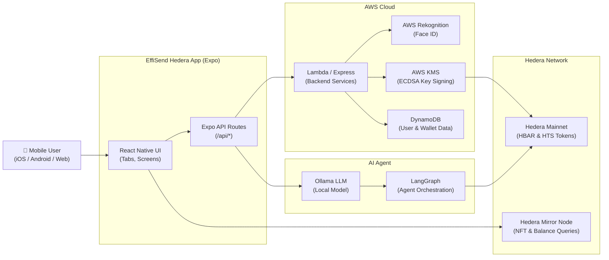

# EffiSend Hedera

> A biometric-secured, AI-powered crypto payment wallet built on the Hedera network.

[](./LICENSE)
[](https://expo.dev)
[](https://reactnative.dev)
[](https://hedera.com)
[](#)

---

## Description

**EffiSend Hedera** is a cross-platform (iOS, Android, Web) mobile wallet application that enables fast, secure cryptocurrency payments on the **Hedera** network. It combines **Face ID biometric authentication** (powered by AWS Rekognition) with **AWS KMS-custodied keys** to remove the need for seed phrases, making self-custody accessible to everyday users.

The app provides a full-featured DeFi experience: send/receive HBAR and HTS tokens via QR code, scan payment requests, collect NFT POAPs and passes, earn rewards, and get real-time financial assistance from an **AI agent** (LangChain + Ollama) with live Hedera balance awareness.

**Target users:** Mobile-first crypto users, DeFi newcomers who want self-custody without seed phrase complexity, and developers building on the Hedera network.

**Core problem solved:** Traditional wallets require users to manage private keys or seed phrases — a significant UX barrier. EffiSend Hedera replaces this with facial recognition, backed by AWS KMS signing and DynamoDB account storage, providing non-custodial-style security with a Web2-friendly onboarding experience.

---

## Table of Contents

- [Features](#features)
- [Tech Stack](#tech-stack)
- [Architecture Overview](#architecture-overview)
- [Installation](#installation)
- [Usage](#usage)
- [Configuration](#configuration)
- [Screenshots / Demo](#screenshots--demo)
- [API / CLI Reference](#api--cli-reference)
- [Tests](#tests)
- [Roadmap](#roadmap)
- [Contributing](#contributing)
- [License](#license)
- [Contact / Support](#contact--support)

---

## Features

- 🔐 **Biometric Wallet Creation** — Create or recover your wallet using Face ID via AWS Rekognition; no seed phrases required.
- 💸 **Send & Receive HBAR / HTS Tokens** — Transfer native HBAR and Hedera Token Service (HTS) assets with a virtual keyboard UI.
- 📷 **QR Code Payments** — Generate styled QR codes for receiving payments; scan QR codes with the built-in camera to pay.
- 🤖 **AI Financial Agent** — Chat with an on-device LangChain + Ollama agent that can query your Hedera balance and assist with payments.
- 🔑 **AWS KMS Transaction Signing** — Private keys are never exposed; all transactions are signed via AWS KMS ECDSA keys.
- 🏅 **NFT POAP & Pass Gallery** — View Hedera NFT collections, POAPs, and passes directly in the wallet.
- 🎁 **Rewards System** — Earn and claim on-chain rewards from within the app.
- 🌐 **Cross-Platform** — Runs on iOS, Android, and Web (Expo + Metro bundler).
- 🧾 **Transaction Receipts** — Generate and print payment receipts via the built-in print module.
- 🌙 **Dark / Light Theme** — Automatic theme detection via system preference.

---

## Tech Stack

| Layer | Technology |
|---|---|
| **Mobile Framework** | [React Native 0.79](https://reactnative.dev) + [Expo 53](https://expo.dev) |
| **Navigation** | [Expo Router 5](https://expo.github.io/router) (file-based routing) |
| **Blockchain SDK** | [@hashgraph/sdk 2.64.5](https://github.com/hashgraph/hedera-sdk-js) |
| **EVM Compatibility** | [ethers.js v6](https://docs.ethers.org/v6/) |
| **AI Agent** | [LangChain](https://www.langchain.com) + [LangGraph](https://langchain-ai.github.io/langgraphjs/) + [Ollama](https://ollama.ai) |
| **Biometric Auth** | [AWS Rekognition](https://aws.amazon.com/rekognition/) |
| **Key Management** | [AWS KMS](https://aws.amazon.com/kms/) (ECDSA signing) |
| **Database** | [AWS DynamoDB](https://aws.amazon.com/dynamodb/) |
| **Backend Runtime** | [Node.js](https://nodejs.org) + [Express](https://expressjs.com) / [AWS Lambda](https://aws.amazon.com/lambda/) |
| **State Management** | React Context API + Async/Secure Storage |
| **Styling** | Custom StyleSheet + [Expo Linear Gradient](https://docs.expo.dev/versions/latest/sdk/linear-gradient/) |

---

## Architecture Overview



The **Expo React Native app** serves as both the front-end and a lightweight API layer (via Expo Router API Routes). When a user authenticates, the app calls the backend which uses **AWS Rekognition** to match their face and **DynamoDB** to retrieve their Hedera account. Transactions are submitted to the **Hedera Mainnet** after being signed by **AWS KMS**, ensuring private keys are never exposed client-side. The **AI agent** (LangGraph + Ollama) connects directly to the Hedera network to provide real-time balance and token data during chat sessions.

---

## Installation

### Prerequisites

- [Node.js](https://nodejs.org) ≥ 20.x
- [npm](https://www.npmjs.com) ≥ 10.x or [Yarn](https://yarnpkg.com)
- [Expo CLI](https://docs.expo.dev/get-started/installation/) (`npm install -g expo-cli`)
- [EAS CLI](https://docs.expo.dev/eas/) (`npm install -g eas-cli`) — for builds and deployment
- An **AWS account** with Rekognition, KMS, and DynamoDB configured
- A **Hedera Mainnet** account (for the backend operator)
- [Ollama](https://ollama.ai) installed locally (for the AI agent)

### Steps

1. **Clone the repository**

   ```bash
   git clone https://github.com/altaga/EffiSend-Hedera.git
   cd EffiSend-Hedera
   ```

2. **Install mobile app dependencies**

   ```bash
   cd effisend-hedera
   npm install
   ```

3. **Configure environment variables**

   Copy the example env file and fill in your values:

   ```bash
   cp .env.example .env
   # Edit .env with your API endpoints (see Configuration section)
   ```

4. **Install agent/backend dependencies**

   ```bash
   cd ../agent
   npm install
   ```

5. **Start the Expo development server**

   ```bash
   cd ../effisend-hedera
   npx expo start
   ```

6. **Start the AI agent server** (separate terminal)

   ```bash
   cd agent
   node agent.js
   ```

---

## Usage

### Running on a device / simulator

```bash
# Start for iOS simulator
cd effisend-hedera && npx expo start --ios

# Start for Android emulator
cd effisend-hedera && npx expo start --android

# Start for web browser
cd effisend-hedera && npx expo start --web
```

### Building for production (web)

```bash
cd effisend-hedera
npx expo export -p web && eas deploy --prod
```

### First-time wallet setup

1. Launch the app and tap **Create Wallet**.
2. Allow camera permissions — the app captures your face for biometric registration via **AWS Rekognition**.
3. Your Hedera account is created and linked to your face signature in DynamoDB.
4. You are redirected to the main dashboard with your **Account ID** and **HBAR balance**.

### Sending a payment

1. Navigate to the **Send** tab.
2. Enter the amount and select the token (HBAR or HTS).
3. Scan the recipient's **QR code** or enter their Hedera Account ID manually.
4. Confirm and submit — the transaction is signed via **AWS KMS** and broadcast to Hedera Mainnet.

### Chatting with the AI Agent

```
User: What is my current HBAR balance?
Agent: Your account 0.0.XXXXX currently holds 42.38 HBAR.

User: Send 5 HBAR to 0.0.99999
Agent: Preparing transfer of 5 HBAR to account 0.0.99999...
```

---

## Configuration

All environment variables are defined in [`effisend-hedera/.env`](effisend-hedera/.env).

| Variable | Description | Example |
|---|---|---|
| `CREATE_OR_FETCH_WALLET_API` | Endpoint to create or fetch a Hedera wallet | `http://localhost:3001/createOrFetchWallet` |
| `CREATE_PAYMENT_URL_API` | Endpoint to create a payment request | `http://localhost:3001/createPayment` |
| `EXECUTE_PAYMENT_API` | Endpoint to execute a signed transaction | `http://localhost:3001/executePayment` |
| `FETCH_PAYMENT_URL_API` | Endpoint to fetch a payment by ID | `http://localhost:3001/fetchPayment` |
| `HEDERA_GET_BALANCE_API` | Endpoint to query HBAR / token balances | `http://localhost:3001/hederaGetBalance` |
| `GET_REWARDS_API` | Endpoint to retrieve user rewards | `http://localhost:3001/getRewards` |
| `CLAIM_REWARDS_API` | Endpoint to claim accumulated rewards | `http://localhost:3001/claimRewards` |
| `AGENT_URL_API` | Endpoint for the AI agent chat | `http://localhost:3001/chatWithAgent` |
| `AI_URL_API_KEY` | API key for AI service authentication | `your_api_key_here` |
| `FACEID_API` | Base URL for Face ID operations | `http://localhost:3001/faceId/` |

### AWS Configuration

The backend services require standard AWS SDK environment variables or an IAM role:

```bash
AWS_REGION=us-east-1
AWS_ACCESS_KEY_ID=<your-access-key>
AWS_SECRET_ACCESS_KEY=<your-secret-key>
COLLECTION_ID=<rekognition-face-collection-id>
```

### DynamoDB

Update the `TABLE_NAME` constant in [`amazonkms/transaction.js`](amazonkms/transaction.js:11) to match your DynamoDB table name.

---

## Screenshots / Demo

| Wallet Dashboard | Send Payment | AI Agent Chat |
|---|---|---|
|  | _\<ADD SEND SCREEN SCREENSHOT\>_ | _\<ADD AGENT SCREENSHOT\>_ |

> 🔗 **Live Demo:** _\<ADD DEPLOYMENT URL HERE\>_

---

## API / CLI Reference

The app exposes internal **Expo API Routes** (server-side handlers) under `/api/*`. These are called by the React Native UI and can also be used by the standalone backend.

### `POST /api/createOrFetchWallet`

Creates a new Hedera wallet or retrieves an existing one linked to the user identifier.

**Request**

```json
{
  "user": "face-hash-uuid-string"
}
```

**Response**

```json
{
  "result": {
    "accountId": "0.0.123456",
    "publicKey": "302a300506..."
  },
  "error": null
}
```

---

### `POST /api/executePayment`

Submits a signed Hedera transaction.

**Request**

```json
{
  "user": "face-hash-uuid-string",
  "chainType": "hedera",
  "tokenId": "HBAR",
  "amount": "5.0",
  "to": "0.0.99999"
}
```

**Response**

```json
{
  "result": "0x4a3f...transactionHash",
  "error": null
}
```

---

### `POST /api/chatWithAgent`

Sends a message to the LangGraph AI agent.

**Request**

```json
{
  "message": "What is my HBAR balance?",
  "context": {
    "accountId": "0.0.123456",
    "user": "face-hash-uuid-string"
  }
}
```

**Response**

```json
{
  "result": "Your account 0.0.123456 currently holds 42.38 HBAR.",
  "error": null
}
```

---

## Tests

> ⚠️ **Note:** The project does not currently include an automated test suite. The following describes manual verification steps and linting.

### Lint

```bash
cd effisend-hedera
npm run lint
```

This runs ESLint with the [Expo ESLint config](effisend-hedera/eslint.config.js).

### Manual QA Checklist

- [ ] Wallet creation via Face ID completes successfully.
- [ ] HBAR balance loads on the dashboard.
- [ ] QR code scanning triggers payment flow.
- [ ] AI agent responds with correct account balance.
- [ ] Transaction receipt prints without errors.

> 🚧 **Roadmap item:** Add Jest + React Native Testing Library unit tests and integration tests against a Hedera testnet environment.

---

## Roadmap

- [ ] **Hedera Testnet mode** — Toggle between mainnet and testnet for developer testing.
- [ ] **Multi-language support** — i18n with at least English, Spanish, and French.
- [ ] **Push notifications** — Notify users of incoming transactions.
- [ ] **Hardware wallet integration** — Support Ledger signing as an alternative to AWS KMS.
- [ ] **Automated test suite** — Jest unit tests + Detox E2E tests.
- [ ] **EVM sidechain support** — Extend the `EVMChain` adapter to additional networks (e.g., Ethereum, Polygon).
- [ ] **Fiat on-ramp** — Integrate a fiat-to-HBAR on-ramp provider.
- [ ] **Passkey / WebAuthn** — Add an alternative biometric path using device passkeys.

---

## Contributing

Contributions, issues, and feature requests are welcome!

1. **Fork** the repository and create your feature branch:
   ```bash
   git checkout -b feature/my-new-feature
   ```
2. **Commit** your changes with a clear message:
   ```bash
   git commit -m "feat: add new payment feature"
   ```
3. **Push** to your branch and open a **Pull Request** against `main`.
4. Ensure your code passes `npm run lint` before submitting.
5. For bug reports or feature requests, please [open an issue](https://github.com/altaga/EffiSend-Hedera/issues).

### Code Style

- Follow the existing ESLint configuration in [`effisend-hedera/eslint.config.js`](effisend-hedera/eslint.config.js).
- Use functional components with hooks where possible (new screens should follow this pattern).
- Keep API route handlers in `effisend-hedera/src/app/api/`.

---

## License

This project is licensed under the **MIT License** — see the [`LICENSE`](LICENSE) file for details.

Copyright © 2025 Víctor Altamirano

---

## Contact / Support

**Maintainer:** Víctor Altamirano

- 🐙 **GitHub:** [@altaga](https://github.com/altaga)
- 🌐 **Project Repository:** [github.com/altaga/EffiSend-Hedera](https://github.com/altaga/EffiSend-Hedera)
- 📧 **Email:** _\<ADD CONTACT EMAIL HERE\>_
- 🚀 **Live Demo:** _\<ADD DEPLOYMENT URL HERE\>_

For questions, bugs, or support, please [open a GitHub issue](https://github.com/altaga/EffiSend-Hedera/issues). Pull requests are always welcome.
